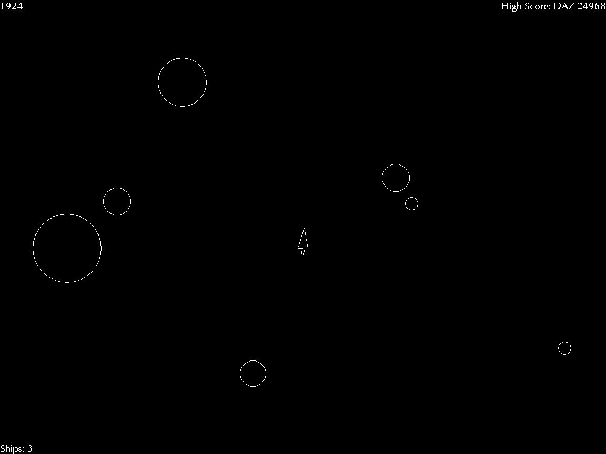



## Azteroids

### Description

Version: Added Pause Function(P), fixed some bugs

Version: Fixed missing .BAS file

It's a game of asteroids, using classes, shapes, and trigonometry. I know it's been done before, but I got into the idea of doing it... Up cursor to thrust, Left & Right Cursor to turn, Space to fire. Escape to end. Runs well on PIII 500 Wint NT, I'd be interested to know how it runs under other O/S's. It's a lot easier to play at higher resolutions - 640 X 480 is too hard.
 
### More Info
 
Puts high-scores in registry

             |
---                |---
**Submitted On**   |2002-03-27 16:42:30
**By**             |[Azrael](https://github.com/Planet-Source-Code/PSCIndex/blob/master/ByAuthor/azrael.md)
**Level**          |Advanced
**User Rating**    |5.0 (10 globes from 2 users)
**Compatibility**  |VB 6\.0
**Category**       |[Games](https://github.com/Planet-Source-Code/PSCIndex/blob/master/ByCategory/games__1-38.md)
**World**          |[Visual Basic](https://github.com/Planet-Source-Code/PSCIndex/blob/master/ByWorld/visual-basic.md)
**Archive File**   |[Azteroids661313282002\.zip](https://github.com/Planet-Source-Code/azrael-azteroids__1-32944/archive/master.zip)

### API Declarations

ShowCursor

